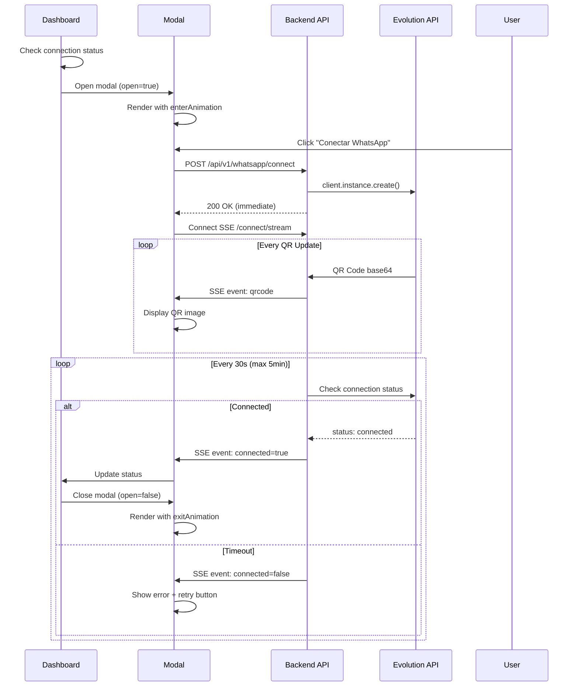

# Design Document

## Overview

A integração WhatsApp-Evolution consiste em três camadas principais:

1. **Frontend (React)**: Componente modal configurável com animações Framer Motion e conexão SSE
2. **Backend (Express)**: API intermediária que gerencia instâncias Evolution e streaming de eventos
3. **Evolution API**: Serviço externo para gerenciamento de conexões WhatsApp

O fluxo principal é:
- Dashboard detecta desconexão → Exibe modal → Usuário clica conectar → Backend cria instância → Evolution gera QR → Backend stream via SSE → Modal exibe QR → Usuário escaneia → Evolution confirma → Backend notifica → Modal fecha

## Architecture

### Component Diagram

```mermaid
graph TB
    subgraph "Frontend - React"
        A[App.tsx] --> B[WhatsAppConnectionProvider]
        B --> C[ConfigurableModal]
        C --> D[QRCodeDisplay]
        C --> E[ConnectionStatus]
        B --> F[useSSE Hook]
        G[whatsAppModalConfig.spec.ts] -.config.-> C
    end
    
    subgraph "Backend - Express"
        H[/api/v1/whatsapp/connect] --> I[WhatsAppController]
        I --> J[EvolutionService]
        J --> K[SSEManager]
        K --> L[StatusChecker]
    end
    
    subgraph "External"
        M[Evolution API]
    end
    
    F -->|SSE Stream| K
    I -->|POST /instance/create| M
    J -->|GET /instance/status| M
    M -->|QR Code Events| J
```

### Data Flow Sequence



## Components and Interfaces

### Frontend Components

#### 1. ConfigurableModal Component

**Arquivo**: `app/src/components/ConfigurableModal.tsx`

**Props Interface**:
```typescript
interface ConfigurableModalProps {
  open: boolean;
  config: ModalConfig;
  onClose: () => void;
  children: React.ReactNode;
}
```

**Responsabilidades**:
- Renderizar overlay com blur e opacidade configuráveis
- Aplicar animações Framer Motion baseadas em config
- Gerenciar eventos de fechamento (ESC, click overlay)
- Adaptar ao tema atual (dark/light)
- Aplicar classes CSS dinâmicas do config

**Implementação**:
```typescript
// Pseudo-código estrutural
const ConfigurableModal: React.FC<ConfigurableModalProps> = ({
  open,
  config,
  onClose,
  children
}) => {
  // Listener para ESC key
  useEffect(() => {
    if (config.behavior?.escClose) {
      const handleEsc = (e: KeyboardEvent) => {
        if (e.key === 'Escape') onClose();
      };
      window.addEventListener('keydown', handleEsc);
      return () => window.removeEventListener('keydown', handleEsc);
    }
  }, [config.behavior?.escClose, onClose]);

  // Construir classes CSS dinamicamente
  const modalClasses = [
    config.bg?.color || 'bg-white/95 dark:bg-slate-900/95',
    config.size?.width || 'w-screen',
    config.size?.height || 'h-screen',
    config.size?.mdWidth || 'md:w-[70%]',
    config.size?.mdHeight || 'md:h-[80%]',
    config.size?.maxWidth || 'max-w-2xl',
    config.size?.maxHeight || 'max-h-[90vh]',
    'rounded-lg shadow-2xl overflow-hidden'
  ].join(' ');

  const overlayClasses = [
    config.overlay?.color || 'bg-black/50',
    config.overlay?.blur || 'backdrop-blur-md'
  ].join(' ');

  return (
    <AnimatePresence>
      {open && (
        <motion.div
          className="fixed inset-0 z-50 flex items-center justify-center"
          initial={{ opacity: 0 }}
          animate={{ opacity: 1 }}
          exit={{ opacity: 0 }}
        >
          {/* Overlay */}
          <motion.div
            className={overlayClasses}
            onClick={config.overlay?.clickClose ? onClose : undefined}
          />
          
          {/* Modal Content */}
          <motion.div
            className={modalClasses}
            initial={config.behavior?.enterAnimation?.start}
            animate={config.behavior?.enterAnimation?.finish}
            exit={config.behavior?.exitAnimation?.finish}
            transition={{
              duration: (config.behavior?.enterAnimation?.finish?.time || 300) / 1000
            }}
          >
            {children}
          </motion.div>
        </motion.div>
      )}
    </AnimatePresence>
  );
};
```

#### 2. WhatsAppConnectionModal Component

**Arquivo**: `app/src/components/WhatsAppConnectionModal.tsx`

**Props Interface**:
```typescript
interface WhatsAppConnectionModalProps {
  open: boolean;
  onClose: () => void;
}
```

**State Management**:
```typescript
interface ConnectionState {
  status: 'idle' | 'connecting' | 'connected' | 'error';
  qrCode: string | null;
  error: string | null;
}
```

**Responsabilidades**:
- Gerenciar estado da conexão
- Iniciar processo de conexão via API
- Consumir eventos SSE
- Exibir QR code ou mensagens de status
- Fornecer botão de retry em caso de erro

#### 3. useSSE Custom Hook

**Arquivo**: `app/src/hooks/useSSE.ts`

**Interface**:
```typescript
interface UseSSEOptions {
  url: string;
  onMessage: (event: MessageEvent) => void;
  onError?: (error: Event) => void;
  enabled: boolean;
}

function useSSE(options: UseSSEOptions): {
  isConnected: boolean;
  close: () => void;
}
```

**Responsabilidades**:
- Estabelecer conexão EventSource
- Gerenciar lifecycle (connect, disconnect, cleanup)
- Parsear eventos SSE
- Reconectar automaticamente em caso de erro (com backoff)

#### 4. WhatsAppConnectionProvider Context

**Arquivo**: `app/src/contexts/WhatsAppConnectionContext.tsx`

**Context Value**:
```typescript
interface WhatsAppConnectionContextValue {
  isConnected: boolean;
  checkConnection: () => Promise<void>;
  connect: () => Promise<void>;
  disconnect: () => Promise<void>;
}
```

**Responsabilidades**:
- Manter estado global da conexão WhatsApp
- Verificar status ao montar App
- Fornecer métodos para componentes filhos

### Backend Components

#### 1. WhatsApp Router

**Arquivo**: `server/src/routes/whatsapp.ts`

**Endpoints**:
```typescript
POST   /api/v1/whatsapp/connect
GET    /api/v1/whatsapp/connect/stream (SSE)
GET    /api/v1/whatsapp/status
DELETE /api/v1/whatsapp/disconnect
```

#### 2. EvolutionService

**Arquivo**: `server/src/services/evolutionService.ts`

**Interface**:
```typescript
class EvolutionService {
  private client: EvolutionClient;
  private instances: Map<string, InstanceData>;

  async createInstance(sessionId: string): Promise<string>;
  async getQRCode(instanceName: string): Promise<string>;
  async checkStatus(instanceName: string): Promise<ConnectionStatus>;
  async deleteInstance(instanceName: string): Promise<void>;
}

interface InstanceData {
  instanceName: string;
  sessionId: string;
  createdAt: Date;
  status: ConnectionStatus;
}
```

**Responsabilidades**:
- Inicializar SDK Evolution com credenciais
- Criar instâncias únicas por sessão
- Consultar status de conexão
- Gerenciar lifecycle de instâncias

#### 3. SSEManager

**Arquivo**: `server/src/services/sseManager.ts`

**Interface**:
```typescript
class SSEManager {
  private connections: Map<string, Response>;

  addConnection(sessionId: string, res: Response): void;
  sendEvent(sessionId: string, event: SSEEvent): void;
  closeConnection(sessionId: string): void;
}

interface SSEEvent {
  type: 'qrcode' | 'status' | 'error';
  data: any;
}
```

**Responsabilidades**:
- Gerenciar conexões SSE ativas
- Enviar eventos formatados para clientes
- Limpar conexões encerradas

#### 4. StatusChecker

**Arquivo**: `server/src/services/statusChecker.ts`

**Interface**:
```typescript
class StatusChecker {
  private intervals: Map<string, NodeJS.Timeout>;

  startChecking(
    instanceName: string,
    sessionId: string,
    onStatusChange: (status: ConnectionStatus) => void
  ): void;
  
  stopChecking(instanceName: string): void;
}
```

**Responsabilidades**:
- Iniciar verificação periódica (30s)
- Implementar timeout de 5 minutos
- Notificar mudanças de status via callback
- Limpar intervalos ao conectar ou timeout

## Data Models

### ModalConfig Type

**Arquivo**: `app/src/components/specs/whatsAppModalConfig.spec.ts`

```typescript
export interface ModalConfig {
  bg?: {
    color?: string;
    gradient?: string;
  };
  font?: {
    title?: { color?: string; family?: string; size?: string };
    text?: { color?: string; family?: string; size?: string };
    link?: { color?: string; family?: string; size?: string };
  };
  size?: {
    width?: string;
    height?: string;
    mdWidth?: string;
    mdHeight?: string;
    maxWidth?: string;
    maxHeight?: string;
  };
  overlay?: {
    color?: string;
    opacity?: number;
    blur?: string;
    visible?: boolean;
    clickClose?: boolean;
  };
  grid?: {
    cols?: number;
    lines?: number;
  };
  behavior?: {
    enterAnimation?: AnimationConfig;
    exitAnimation?: AnimationConfig;
    hoverAnimation?: { scale?: number; opacity?: number };
    escClose?: boolean;
  };
}

interface AnimationConfig {
  start?: { scale?: number; opacity?: number; blur?: string };
  finish?: { scale?: number; opacity?: number; blur?: string; time?: number };
}
```

### SSE Event Types

```typescript
// QR Code Event
{
  type: 'qrcode',
  data: {
    qrcode: string; // base64
    timestamp: string;
  }
}

// Status Event
{
  type: 'status',
  data: {
    connected: boolean;
    instanceName: string;
    timestamp: string;
  }
}

// Error Event
{
  type: 'error',
  data: {
    code: string;
    message: string;
    timestamp: string;
  }
}
```

### Environment Variables

```bash
# Evolution API Configuration
EVOLUTION_API_URL=https://evolution-api.example.com
EVOLUTION_API_KEY=your-api-key-here

# Optional
EVOLUTION_INSTANCE_PREFIX=neuropgrag
EVOLUTION_CHECK_INTERVAL=30000  # 30s in ms
EVOLUTION_TIMEOUT=300000        # 5min in ms
```

## Error Handling

### Frontend Error States

1. **Connection Failed**: Exibir mensagem "Falha ao conectar com servidor" + botão retry
2. **QR Timeout**: Exibir "QR Code expirado" + botão "Gerar novo QR"
3. **Evolution API Error**: Exibir mensagem específica da API + botão retry
4. **Network Error**: Exibir "Sem conexão com internet" + retry automático

### Backend Error Responses

```typescript
// Erro ao criar instância
{
  error: 'INSTANCE_CREATION_FAILED',
  message: 'Falha ao criar instância na Evolution API',
  details: string,
  timestamp: string
}

// Erro de autenticação Evolution
{
  error: 'EVOLUTION_AUTH_FAILED',
  message: 'Credenciais inválidas para Evolution API',
  timestamp: string
}

// Erro de timeout
{
  error: 'CONNECTION_TIMEOUT',
  message: 'Tempo limite de 5 minutos excedido',
  timestamp: string
}
```

### Error Recovery Strategies

1. **SSE Disconnect**: Reconectar automaticamente com exponential backoff (1s, 2s, 4s, 8s, max 30s)
2. **Evolution API Down**: Retornar erro 503 e sugerir retry após 30s
3. **Instance Already Exists**: Reutilizar instância existente se criada há menos de 10min
4. **QR Expired**: Solicitar novo QR automaticamente (Evolution regenera)

## Testing Strategy

### Unit Tests

**Frontend**:
- `ConfigurableModal.test.tsx`: Testar renderização com diferentes configs, eventos de fechamento, animações
- `useSSE.test.ts`: Testar conexão, recebimento de eventos, reconexão, cleanup
- `WhatsAppConnectionModal.test.tsx`: Testar estados (idle, connecting, connected, error), exibição de QR

**Backend**:
- `evolutionService.test.ts`: Testar criação de instância, consulta de status, mocks da SDK
- `sseManager.test.ts`: Testar adição/remoção de conexões, envio de eventos
- `statusChecker.test.ts`: Testar início/parada de verificação, timeout de 5min

### Integration Tests

1. **Fluxo Completo de Conexão**:
   - Mock Evolution API retornando QR e status
   - Verificar SSE stream recebe eventos corretos
   - Verificar modal fecha ao receber connected=true

2. **Timeout Scenario**:
   - Mock Evolution API nunca retornando connected
   - Verificar que após 5min recebe connected=false
   - Verificar que verificações param

3. **Error Handling**:
   - Mock Evolution API retornando erro 500
   - Verificar que frontend recebe evento de erro
   - Verificar que retry funciona

### E2E Tests (Manual)

1. Abrir dashboard desconectado → Modal abre automaticamente
2. Clicar "Conectar WhatsApp" → QR aparece em <5s
3. Escanear QR com WhatsApp → Modal fecha em <2s após conexão
4. Desconectar WhatsApp → Modal reabre automaticamente
5. Testar tema claro/escuro → Modal adapta cores
6. Pressionar ESC → Modal fecha
7. Clicar fora do modal → Modal fecha

## Performance Considerations

1. **SSE Connection Pooling**: Limitar máximo de 100 conexões SSE simultâneas
2. **Instance Cleanup**: Deletar instâncias não conectadas após 10 minutos
3. **QR Code Caching**: Não cachear (sempre usar último QR da Evolution)
4. **Status Check Debouncing**: Evitar múltiplas verificações simultâneas
5. **Modal Animation**: Usar GPU acceleration (transform, opacity) para 60fps

## Security Considerations

1. **API Key Protection**: Nunca expor EVOLUTION_API_KEY no frontend
2. **Session Validation**: Validar sessionId antes de criar instância
3. **Rate Limiting**: Máximo 5 tentativas de conexão por IP por hora
4. **CORS**: Restringir origins permitidos em produção
5. **SSE Authentication**: Validar token JWT em conexões SSE
6. **Instance Isolation**: Garantir que usuários não acessem instâncias de outros

## Deployment Notes

1. **Environment Setup**: Configurar variáveis EVOLUTION_API_URL e EVOLUTION_API_KEY
2. **Health Check**: Adicionar endpoint `/health/evolution` que testa conectividade com Evolution API
3. **Monitoring**: Logar todas as criações de instância e mudanças de status
4. **Graceful Shutdown**: Fechar todas as conexões SSE e deletar instâncias ao desligar servidor
5. **Scaling**: SSE não funciona bem com múltiplas instâncias (usar Redis pub/sub se necessário)
