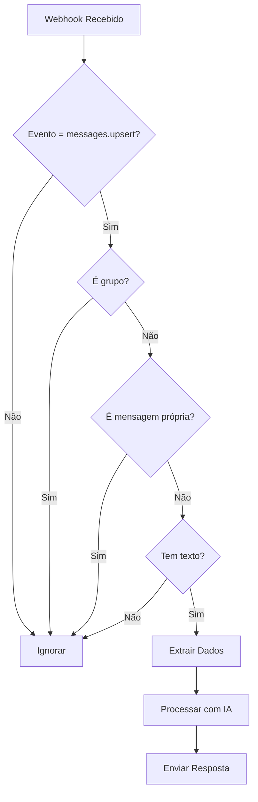

# Webhook WhatsApp - Evolution API

Documentação do endpoint de webhook para receber mensagens do WhatsApp via Evolution API.

## 📡 Endpoint

```
POST /api/v1/webhook
```

## 🔧 Configuração na Evolution API

1. Acesse o painel da Evolution API
2. Configure o webhook URL: `https://seu-dominio.com/api/v1/webhook`
3. Selecione o evento: `messages.upsert`

## 📨 Payload Recebido

```json
{
  "event": "messages.upsert",
  "instance": "instance-name",
  "data": {
    "key": {
      "remoteJid": "5511999999999@s.whatsapp.net",
      "fromMe": false,
      "id": "3EB0XXXXX"
    },
    "pushName": "João Silva",
    "message": {
      "conversation": "Olá, preciso de ajuda"
    },
    "messageType": "conversation",
    "messageTimestamp": 1234567890
  }
}
```

## ✅ Mensagens Processadas

O webhook processa apenas:
- ✅ Evento `messages.upsert`
- ✅ Mensagens individuais (não grupos)
- ✅ Mensagens recebidas (não enviadas por nós)
- ✅ Mensagens com texto

## ⏭️ Mensagens Ignoradas

O webhook ignora:
- ❌ Outros eventos (connection.update, etc)
- ❌ Mensagens de grupos (`@g.us`)
- ❌ Mensagens enviadas por nós (`fromMe: true`)
- ❌ Mensagens sem texto (imagens, áudios, etc)

## 🔍 Extração de Dados

### Telefone do Contato
```typescript
function extractPhoneNumber(remoteJid: string): string {
  // Remove o sufixo @s.whatsapp.net
  return remoteJid.replace('@s.whatsapp.net', '');
}
```

**Exemplo:**
- Input: `5511999999999@s.whatsapp.net`
- Output: `5511999999999`

### Texto da Mensagem
```typescript
function extractMessageText(message: any): string {
  if (message.conversation) {
    return message.conversation;
  }
  if (message.extendedTextMessage?.text) {
    return message.extendedTextMessage.text;
  }
  return '';
}
```

## 📤 Resposta do Webhook

### Sucesso (200)
```json
{
  "success": true,
  "message": "Mensagem recebida e processada",
  "data": {
    "phoneNumber": "5511999999999",
    "pushName": "João Silva",
    "messageText": "Olá, preciso de ajuda",
    "messageId": "3EB0XXXXX"
  }
}
```

### Evento Ignorado (200)
```json
{
  "success": true,
  "message": "Evento ignorado"
}
```

### Grupo Ignorado (200)
```json
{
  "success": true,
  "message": "Mensagens de grupo não são processadas"
}
```

### Erro (200)
```json
{
  "success": false,
  "error": "Erro ao processar mensagem",
  "message": "Detalhes do erro"
}
```

**Nota:** Sempre retorna status 200 para evitar reenvio do webhook pela Evolution API.

## 🧪 Testar Webhook

### 1. Usando cURL
```bash
curl -X POST http://localhost:4000/api/v1/webhook \
  -H "Content-Type: application/json" \
  -d '{
    "event": "messages.upsert",
    "instance": "test",
    "data": {
      "key": {
        "remoteJid": "5511999999999@s.whatsapp.net",
        "fromMe": false,
        "id": "msg-123"
      },
      "pushName": "João Silva",
      "message": {
        "conversation": "Olá, preciso de ajuda"
      },
      "messageType": "conversation",
      "messageTimestamp": 1234567890
    }
  }'
```

### 2. Usando Postman
1. Método: POST
2. URL: `http://localhost:4000/api/v1/webhook`
3. Headers: `Content-Type: application/json`
4. Body: (copie o JSON acima)

### 3. Verificar Status
```bash
curl http://localhost:4000/api/v1/webhook
```

## 📊 Logs

O webhook gera logs detalhados:

```
📨 Webhook recebido: messages.upsert
📱 Telefone: 5511999999999
👤 Nome: João Silva
💬 Mensagem: Olá, preciso de ajuda
✅ Mensagem processada com sucesso
```

Mensagens ignoradas:
```
⏭️ Evento ignorado: connection.update
⏭️ Mensagem de grupo ignorada
⏭️ Mensagem própria ignorada
⏭️ Mensagem sem texto ignorada
```

## 🔄 Fluxo de Processamento



## 🚀 Próximos Passos (TODO)

- [ ] Integrar com sistema RAG
- [ ] Buscar contexto relevante dos documentos
- [ ] Gerar resposta com LLM (OpenRouter)
- [ ] Enviar resposta via Evolution API
- [ ] Salvar histórico de conversas
- [ ] Implementar rate limiting
- [ ] Adicionar autenticação do webhook

## 🔐 Segurança

**Recomendações:**
1. Use HTTPS em produção
2. Adicione autenticação (API Key, JWT)
3. Valide origem das requisições
4. Implemente rate limiting
5. Sanitize inputs antes de processar

## 📚 Referências

- [Evolution API Docs](https://doc.evolution-api.com)
- [WhatsApp Business API](https://developers.facebook.com/docs/whatsapp)
